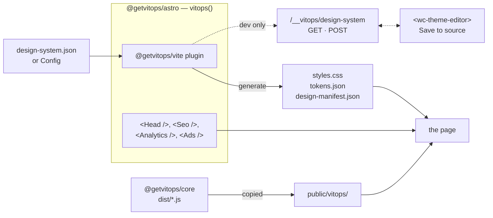
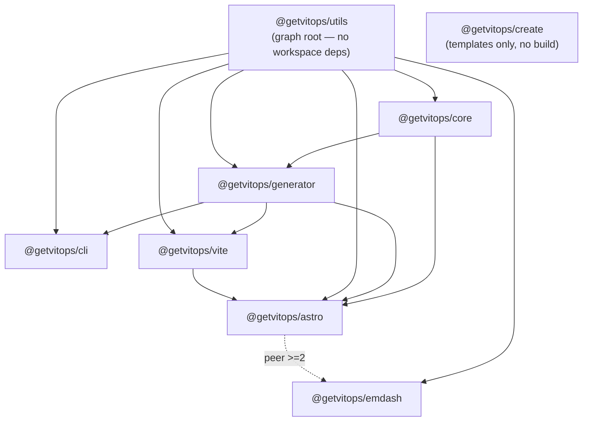
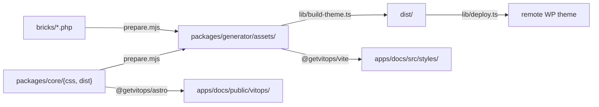

# Architecture

The structural map of this repo: what each package is, which files matter, how the build fits
together, and what is generated vs hand-written. Mostly tables — read it once end to end, then use
it as a lookup.

**This is not the only doc, and deliberately not the biggest.** For the _why_ behind any decision
here — the load-bearing invariants, what breaks if you change something — read
[`AGENTS.md`](AGENTS.md); this file links into it rather than restating it.

| If you want                            | Read                                              |
| -------------------------------------- | ------------------------------------------------- |
| Rationale, invariants, gotchas         | [`AGENTS.md`](AGENTS.md)                          |
| Usage guides + generated reference     | <https://docs.vitops.ca>                          |
| The token brief, as one file           | [`DESIGN.md`](DESIGN.md) (generated)              |
| Per-topic reference, from the CLI      | `vitops docs <topic>` → the OKF bundle in `docs/` |
| **Where things live and how to build** | this file                                         |

---

# Part 1 — For consumers of the toolchain

## 1.1 The model

One JSON config → the generator → per-platform output. There is **no shipped token set**: every
project brings its own consumer-editable `design-system.json` (or the umbrella `Config` that embeds
one), and the generator turns it into Tailwind v4, standalone CSS, a Bricks/WordPress payload, or an
agent-facing brief (DESIGN.md). Nothing in a consumer project is hand-maintained CSS kept in sync with a token
file.

```sh
npm i -D @getvitops/cli
npx vitops init                                     # scaffold a design-system.json
npx vitops generate --format tailwind -o src/styles
```

## 1.2 Package matrix

| Package                | Version | What it is                                                                 | Install when                            |
| ---------------------- | ------- | -------------------------------------------------------------------------- | --------------------------------------- |
| `@getvitops/core`      | 5.0.0   | The framework runtime: CSS partials, Lit web components, browser polyfills | Pulled in by `astro`; direct for Bricks |
| `@getvitops/generator` | 5.0.0   | The generator as a library + the JSON Schemas                              | Building your own integration           |
| `@getvitops/utils`     | 5.0.0   | Shared build-time + utilities (favicon, icons, tracking, notify)           | Pulled in by everything                 |
| `@getvitops/cli`       | 5.0.0   | `vitops` binary — the surface every stack has                              | Always, in any stack                    |
| `@getvitops/vite`      | 5.0.0   | Vite plugin: generate on build/dev, hot-regenerate on config change        | Vite without Astro                      |
| `@getvitops/astro`     | 5.0.0   | The Astro integration + component library                                  | Astro sites (the main path)             |
| `@getvitops/emdash`    | 0.3.5   | EmDash CMS plugin — Portable Text blocks + hosting seam                    | EmDash sites                            |
| `@getvitops/create`    | 0.5.0   | `vp create @getvitops` scaffolds; templates only, no build                 | Starting a new project                  |

**The first six are one version, on purpose.** They're a Changesets `fixed` group, so a lockstep
major can land in a package with no changes of its own. That's not cosmetic: `generator@X` ships a
frozen snapshot of `core@X`'s CSS and JS, while `@getvitops/astro` resolves the _installed_ core at
runtime and copies its bundles into the consumer's `public/`. A page therefore gets its CSS from
`generator@X` and its web components from `core@Y` — `fixed` is what guarantees `X == Y`.
`emdash` and `create` version independently.

## 1.3 Public API surface

### `@getvitops/generator` — grouped exports from `src/index.ts`

| Group             | Members                                                                                              |
| ----------------- | ---------------------------------------------------------------------------------------------------- |
| Generation        | `generate`, `generateDocs`, `generateLegal`, `buildIconSprite`, `defaultConfig`                      |
| Schema            | `DesignSystemSchema`, `ConfigSchema`, `jsonSchema`, `configJsonSchema`, `validate`, `validateConfig` |
| Config resolution | `resolveInput`, `isConfig`, `resolveConfig`, `resolveTheme`, `deepMerge`, `stripNulls`               |
| Tokens            | `expandPalette`, `roleColorUtilities`, `tokenVar`, `tokenClass`, `functionalRole`, `NUMERIC_STEPS`   |
| Tiers             | `TIERS`, `TIER_NAMES`, `tierPatterns`, `tierTags`                                                    |
| Shared constants  | `TW_CLASH`, `BASE_HOOK`, `DARK_SEL`, `REQUIRED_ROLES`, `ROLE_TOKEN_KEYS`, `CONTRAST`                 |
| Legal             | `derivePolicyVars`, `resolveProcessors`, `parseMarkdown`, `toHtmlFragment`, `toPortableText`         |

Types: `DesignSystem`, `Config`, `Format`, `StylesheetFormat`, `Tier`, `RoleSpec`, `PolicyVars`, …

### `@getvitops/cli` — `vitops <command>`

Twelve commands, dispatched in `packages/cli/src/cli.ts`.

| Command    | Function      | Input      | Purpose                                                            |
| ---------- | ------------- | ---------- | ------------------------------------------------------------------ |
| `generate` | `cmdGenerate` | either     | Emit the design-system output(s) for one or more `--format`s       |
| `init`     | `cmdInit`     | —          | Scaffold a starter `design-system.json`                            |
| `validate` | `cmdValidate` | either     | Validate a config against the schema                               |
| `favicon`  | `cmdFavicon`  | either     | Rasterize a source SVG/PNG into the favicon set                    |
| `media`    | `cmdMedia`    | **Config** | Raw video → WebM + MP4 fallback + poster                           |
| `icons`    | `cmdIcons`    | **Config** | Build the SVG sprite from the site's icon vocabulary               |
| `legal`    | `cmdLegal`    | **Config** | Render privacy / terms / cookie notice (`md\|html\|portable-text`) |
| `agents`   | `cmdAgents`   | —          | Link the shipped agent skill into a consumer project               |
| `docs`     | `cmdDocs`     | either     | Print one reference doc to stdout, rendered from your config       |
| `lint`     | `cmdLint`     | either     | Find framework classes that resolve to nothing                     |
| `search`   | `cmdSearch`   | **Config** | `setup` (onboard into Search Console) · `notify` (post-deploy)     |
| `ads`      | `cmdAds`      | **Config** | `setup` (verification DNS) · `tags` (pixels) · `lint` (gaps)       |

"either" = a bare `design-system.json` or the umbrella `Config`. The **Config** rows describe a
_site_ rather than a token set, so they can't take the bare form.

### `@getvitops/astro` — `vitops(options)`

| Option          | What it turns on                                                                    |
| --------------- | ----------------------------------------------------------------------------------- |
| `site`          | The one place to name your `Config`; every option below reads facts from it         |
| `css`           | Run the generator via `@getvitops/vite`; auto-inject the stylesheet                 |
| `webComponents` | Copy core's JS bundles into `public/vitops/`                                        |
| `favicon`       | Generate the favicon set + PWA manifest                                             |
| `icons`         | Scan source and pass a real `include` map to the icon integration (SSR bundle size) |
| `fonts`         | Turn design-system font declarations into Astro's `fonts:` config                   |
| `legal`         | Render the legal documents into a content collection                                |
| `sitemap`       | Configure the `@astrojs/sitemap` peer                                               |
| `seo`           | Site-level SEO defaults merged with per-page props                                  |
| `analytics`     | Which analytics provider tags to emit (consent-gated)                               |
| `tracking`      | Ad-click attribution capture into the first-party `_ac` cookie                      |
| `media`         | Video encoding at build time                                                        |
| `editor`        | Mirror `design-manifest.json` for `<wc-theme-editor>`                               |

Components ship as **source** `.astro` (compiled in the consumer's build):

| Group           | Components                                                                                                                                       |
| --------------- | ------------------------------------------------------------------------------------------------------------------------------------------------ |
| Head / SEO      | `Head`, `Seo`, + 24 JSON-LD emitters under `schemas/`                                                                                            |
| Consent-gated   | `Analytics`, `Ads`, `Tracking`, `CookieConsent`, `GatedTags`                                                                                     |
| Markup wrappers | `Subgrid`, `Cards`, `Tree`/`TreeNode`, `NavShell`/`NavShellToggle`, `Popover`, `Details`, `Drawer`, `Icon`, `NodeRenderer`, `WebComponentLoader` |

Two subpaths are built separately so a Worker route never bundles the integration:
`@getvitops/astro/routes` (the conversion endpoint factory) and `@getvitops/astro/tracking`
(the attribution vocabulary).

### `@getvitops/utils` — nine subpaths

| Subpath        | Runtime         | Purpose                                                               |
| -------------- | --------------- | --------------------------------------------------------------------- |
| `.`            | build           | Content model, HTML helpers, icons, source scanning, JSON-LD builders |
| `./favicon`    | build           | Favicon set generation (lazy `sharp` + `png-to-ico`)                  |
| `./color`      | isomorphic      | OKLCH engine + harmony strategies (colorjs.io)                        |
| `./media`      | build           | Video discovery, ffmpeg encode, committed manifest cache              |
| `./indexing`   | build (CI)      | `vitops search notify` — sitemap resubmit, IndexNow, verify           |
| `./onboarding` | build (one-off) | `vitops search setup` — DNS TXT, verify, add property                 |
| `./ads`        | build           | `vitops ads` — platform capability table, DNS plan                    |
| `./notify`     | **Worker**      | Conversion notifications — plan, render, send                         |
| `./tracking`   | **Worker**      | Attribution vocabulary + the `_ac` cookie                             |

The two Worker entries are separate subpaths precisely so a conversion endpoint doesn't pull
`sharp` into its bundle. Neither may use a Node builtin.

## 1.4 Config anatomy

A `Config` has three sections; `resolveInput` discriminates on the presence of `designSystem`, so
you can hand any command either shape and it does the right thing.

| Section        | Holds                                                                                                               |
| -------------- | ------------------------------------------------------------------------------------------------------------------- |
| `designSystem` | The token set — `themes` / `defaultTheme` / `defaultColorScheme`, or a bare map                                     |
| `organization` | The company — name, contact, locations, services, links                                                             |
| `site`         | One published presentation — locales, domains, environments, SEO, analytics, ads, legal, icons, favicon, deployment |

Output per `--format` (comma-separated lists are allowed, e.g. `--format css,design`):

| Format     | Emits                                                                                              |
| ---------- | -------------------------------------------------------------------------------------------------- |
| `tailwind` | `tailwind.css` (self-contained, Tailwind v4) + `tokens.json`                                       |
| `css`      | `styles.css` (bundled standalone) + `tokens.json` + `design-manifest.json`                         |
| `bricks`   | The full deployable payload: `styles.min.css`, `bricks-*.json`, JS bundles, `bricks/` PHP, `docs/` |
| `design`   | `DESIGN.md` and nothing else                                                                       |

Field-level reference: [`docs/config.md`](docs/config.md) and [`docs/authoring.md`](docs/authoring.md),
both walked from the published JSON Schemas so they can't drift from validation.

## 1.5 How an Astro site wires up



The plugin uses `configResolved` (resolve paths), `buildStart` (`addWatchFile` + generate),
`watchChange` (regenerate + full reload) and `configureServer` (the editor endpoint — registered
only in dev, so it can never exist in a build). It watches exactly the config files:
`input`, `site.input`, `legal.input`.

## 1.6 The three component tiers

Choose by **whether the pattern actually needs JavaScript**. The manifest of which tier provides
each pattern is `packages/generator/src/tiers.ts` — see
[AGENTS.md § Component architecture](AGENTS.md) for the rules and the two deliberate exceptions.

| Tier | Surface                                  | The bar                                                                                                                  |
| ---- | ---------------------------------------- | ------------------------------------------------------------------------------------------------------------------------ |
| 1    | CSS framework (`@getvitops/core` `css/`) | Everything expressible in pure HTML/CSS. Reach here first.                                                               |
| 2    | Web components (`<wc-*>`, Lit)           | Only for patterns that genuinely benefit from progressive enhancement, and they must SSR from accessible fallback markup |
| 3    | Astro components                         | Authoring convenience. Must not require runtime JS.                                                                      |
| 3    | Bricks elements                          | Same tier, sibling platform. No project uses both.                                                                       |

---

# Part 2 — For contributors

## 2.1 Repo map

| Path                 | What's in it                                                                  |
| -------------------- | ----------------------------------------------------------------------------- |
| `packages/`          | The eight workspace packages                                                  |
| `apps/docs/`         | The public docs site (private, isolated from the release DAG)                 |
| `lib/`               | `build-theme.ts` (dogfoods the generator), `deploy.ts` (rsync/symlink)        |
| `src/`               | **Only** `design-system.json` — this repo's dev/example config                |
| `bricks/`            | `load.php` + `elements/*.php` (13 Bricks elements). No `packages/bricks` yet. |
| `docs/`              | The OKF documentation bundle — **generated and tracked**                      |
| `dist/`              | The deployable Bricks payload — gitignored                                    |
| `public/`            | The repo's own favicon set                                                    |
| `index.html`         | Human/local-dev docsite; dogfoods the built `css` format                      |
| `.changeset/`        | Changesets config (the `fixed` group lives here)                              |
| `.github/workflows/` | `ci.yml`, `docs.yml`                                                          |
| `old-css-lib/`       | Legacy CSS, not in any build                                                  |

**The root `package.json` has no `scripts` block.** Everything goes through `npx vp run <task>`
(`vite-plus`). The root depends on `@getvitops/generator` as a workspace dev dep — that's the
dogfooding link `lib/build-theme.ts` uses.

## 2.2 Package dependency graph



**The one-way rule: `core` may never import the `generator`.** The generator snapshots core, not
the reverse. That's why several constants exist in two places with a test holding them together —
`dark-selector.test.ts`, `required-roles.test.ts`, `token-refs.test.ts`, `tiers.test.ts` are all
drift guards for a dependency edge that can't exist.

The same rule shapes `utils`: it cannot import the generator (the generator already depends on it),
so `IndexingConfig`, `TrackingConfig`, `NotificationsConfig` and `DomainSetup` **structurally
mirror** the matching `site.*` blocks, and the CLI adapts between them. The generator _importing_
the utils capability table (`AD_PLATFORMS`) is the allowed direction.

## 2.3 Key files

### `packages/generator/src/`

| File                | Purpose                                                                                                                                                                       |
| ------------------- | ----------------------------------------------------------------------------------------------------------------------------------------------------------------------------- |
| `index.ts`          | Public API barrel + `defaultConfig()` (the `vitops init` starter)                                                                                                             |
| `generate.ts`       | The generator. Also owns `CSS_LAYERS`, `CHUNK_LAYER`, `TAILWIND_SKIP`, `roleColorUtilities`                                                                                   |
| `schema.ts`         | The `design-system.json` schema in `zod/mini` — **the single source of truth**                                                                                                |
| `config.ts`         | The three-section umbrella config; `resolveConfig`, `resolveInput`/`isConfig`, `JURISDICTIONS`, `AD_PROVIDERS`                                                                |
| `tokens.ts`         | OKLCH palette expansion on a shared lightness ladder + the semantic token grammar                                                                                             |
| `token-refs.ts`     | Every authored `var(--…)` must resolve to a token we emit; also `movedTokens` for `lint --fix`                                                                                |
| `tiers.ts`          | The authored tier manifest — which tiers provide each pattern, and the `use` line                                                                                             |
| `layer-contract.ts` | One class, one classification — asserted twice so css and tailwind can't drift                                                                                                |
| `shared.ts`         | Constants shared by `generate.ts` and `docs.ts` (a direct import would be a cycle)                                                                                            |
| `docs.ts`           | `generateDocs()` — the OKF bundle, incl. a small PHP parse of the Bricks elements                                                                                             |
| `design-md.ts`      | The `design` format — `DESIGN.md`                                                                                                                                             |
| `icons-sprite.ts`   | `buildIconSprite`, `spriteId` — the `<use href="…#id">` grammar                                                                                                               |
| `legal/`            | `index.ts` · `derive.ts` (config facts → `PolicyVars`) · `providers.ts` · `render.ts` (closed markdown subset) · `templates/{index,shared,privacy.ca,terms.ca,cookies.ca}.ts` |

`scripts/prepare.mjs` populates `assets/` (gitignored, but shipped in `files`): core's `css/` +
built `dist/*.js`, the repo's `bricks/`, plus `schema.json` and `config.schema.json`.

### `packages/core/`

Five independent browser bundles, each separate for a reason:

| Entry                 | Ships                                 | Why its own bundle                                        |
| --------------------- | ------------------------------------- | --------------------------------------------------------- |
| `src/js/polyfills.ts` | Feature-detected `{test, load}` pairs | Each polyfill is its own async chunk; belongs in `<head>` |
| `src/js/elements.ts`  | The tier-2 Lit registrations          | The deferred main bundle                                  |
| `src/js/deferred.ts`  | Non-critical PE, zero imports         | Nothing to load, runs late                                |
| `src/js/consent.ts`   | The consent gate + `<wc-consent>`     | Must load **ahead** of elements and must not drag in Lit  |
| `src/js/editor.ts`    | `<wc-theme-editor>` only              | Tooling, no no-JS fallback — quarantined, opt-in          |

Seventeen elements under `src/web-components/`, all `wc-*`: `WCCards` `WCCarousel`
`WCColorSchemeToggle` `WCColorWheel` `WCConsent` `WCCopy` `WCDismissable` `WCEntries`
`WCIconPicker` `WCImageCompare` `WCMarquee` `WCMultiField` `WCOklchColorPicker` `WCSplitPanel`
`WCThemeEditor` `WCTree` `WCTypography`. Support: `BaseElement.ts` (Lit + `SignalWatcher`),
`utils/{upgrade,card-click,tree-filter,DragController}.ts` — the middle two are pure decisions
extracted so they can be tested without a DOM.

`src/consent/` splits the same way: `store.ts` is pure and holds everything legally decidable;
`runtime.ts` is the DOM wiring.

`css/` is 5 root partials (`global` `animation` `layout` `layout-utilities` `utilities`) behind the
`index.css` entry, plus 47 under `patterns/`. Import order in `index.css` is load-bearing in three
places — `layout-utilities` before `utilities`, `subgrid` before `card`, `navbar` → `sitenav` →
`navshell` — each annotated in the file. **Cascade-layer assignment is not in the CSS**: it's
applied at bundle time by `CHUNK_LAYER` in `generate.ts`, and an unmapped partial defaults to
`vitops.components`.

### `packages/astro/src/`

| File                                                                   | Purpose                                                              |
| ---------------------------------------------------------------------- | -------------------------------------------------------------------- |
| `integration.ts`                                                       | The whole integration. Uses **one** Astro hook: `astro:config:setup` |
| `analytics.ts` `ads.ts` `tracking.ts` `seo.ts` `fonts.ts` `lastmod.ts` | Pure `resolve*()` decisions — this is where the tests point          |
| `routes/conversion.ts`                                                 | The conversion endpoint factory (Worker-side, separate build entry)  |
| `exports/tracking.ts`                                                  | `@getvitops/astro/tracking` re-export                                |
| `components/*.astro`                                                   | Dumb renderers over the resolvers above                              |
| `scripts/*.ts`                                                         | Browser: click-ID capture, form enhancement, row-stagger             |
| `utils/plan-features.ts`                                               | free/pro gate from `astro:env/server`'s `SITE_PLAN`                  |

This package carries its own [`packages/astro/AGENTS.md`](packages/astro/AGENTS.md) — read it before
adding a component (notably: there is deliberately no site-model layer here).

### Other packages

| Path                                   | Purpose                                                                                                                       |
| -------------------------------------- | ----------------------------------------------------------------------------------------------------------------------------- |
| `packages/vite/src/index.ts`           | The entire plugin: generate on build/dev, watch configs, the editor endpoint                                                  |
| `packages/cli/src/cli.ts`              | Entry; `main()` runs at import, `parseArgs` then a command switch                                                             |
| `packages/cli/src/help.ts`             | All help text — separate because `cli.ts` self-executes                                                                       |
| `packages/cli/src/lint*.ts`            | Four linters: classes that resolve to nothing, CSS re-implementing a primitive, markup skipping a pattern, pre-1.0 token refs |
| `packages/cli/skill/SKILL.md`          | The static agent skill `vitops agents` links into a project                                                                   |
| `packages/utils/src/*/`                | Each network-touching area is `plan.ts` + executor(s) + `types.ts`                                                            |
| `packages/emdash/src/`                 | `blocks.ts` (Portable Text types), `hosting.ts`, `icon-options.ts`, `astro/blocks/*.astro`                                    |
| `packages/create/templates/`           | Verbatim scaffold payload — no `src/`, no build task                                                                          |
| `bricks/load.php`                      | Registers the 13 elements, enqueues the bundles, adds the builder category                                                    |
| `apps/docs/scripts/sync-reference.mjs` | Calls `generateDocs()` and writes the site's Reference section                                                                |

## 2.4 Build pipeline

Every task is `npx vp run <name>`, defined in [`vite.config.ts`](vite.config.ts).

| Task                | Command                                                     | dependsOn                                                           | Notable output                            |
| ------------------- | ----------------------------------------------------------- | ------------------------------------------------------------------- | ----------------------------------------- |
| `build`             | `vp run build:bricks`                                       | —                                                                   | —                                         |
| `build:bricks`      | `vp run build:theme`                                        | —                                                                   | —                                         |
| `build:utils`       | `cd packages/utils && vp pack`                              | — _(graph root)_                                                    | `packages/utils/dist/**`                  |
| `build:core`        | `cd packages/core && vp pack`                               | `build:utils`                                                       | `packages/core/dist/**`                   |
| `build:generator`   | `prepare.mjs && cd packages/generator && vp pack`           | `build:core`                                                        | `dist/**`, `assets/**`, `schema.json`     |
| `build:cli`         | `cd packages/cli && vp pack`                                | `build:generator`, `build:utils`                                    | `packages/cli/dist/**`                    |
| `build:vite-plugin` | `cd packages/vite && vp pack`                               | `build:generator`, `build:utils`                                    | `packages/vite/dist/**`                   |
| `build:astro`       | `cd packages/astro && vp pack`                              | `build:core`, `build:generator`, `build:utils`, `build:vite-plugin` | `packages/astro/dist/**`                  |
| `build:emdash`      | `cd packages/emdash && vp pack`                             | `build:utils`                                                       | `packages/emdash/dist/**`                 |
| `build:theme`       | `node lib/build-theme.ts`                                   | `build:generator`                                                   | `dist/**` + **`docs/**`\*\* (tracked)     |
| `build:docs`        | `… --format css`                                            | `build:generator`                                                   | `dist/styles.css`, `design-manifest.json` |
| `build:tailwind`    | `… --format tailwind`                                       | `build:generator`                                                   | `dist/tailwind.css`                       |
| `build:design`      | `… --format design`                                         | `build:generator`                                                   | **`DESIGN.md`** (repo root, tracked)      |
| `build:packages`    | the six package builds in sequence                          | —                                                                   | —                                         |
| `release:version`   | `changeset version`                                         | —                                                                   | per-package `CHANGELOG.md`                |
| `release`           | `vp test run && vp run build:packages && changeset publish` | —                                                                   | published tarballs                        |
| `deploy`            | `node --env-file=.env lib/deploy.ts`                        | `build`                                                             | the remote theme                          |
| `docs:sync`         | `node apps/docs/scripts/sync-reference.mjs`                 | `build:generator`                                                   | `apps/docs/src/content/docs/reference/**` |
| `docs:dev`          | `pnpm --filter docs exec astro dev`                         | `docs:sync`, `build:astro`                                          | —                                         |
| `docs:build`        | `pnpm --filter docs exec astro build`                       | `docs:sync`, `build:astro`                                          | `apps/docs/dist/**`                       |
| `docs:preview`      | `pnpm --filter docs exec astro preview`                     | —                                                                   | —                                         |

Resolved order: `build:utils` → `build:core` → `build:generator` → everything else.

**Three non-obvious things, each recorded as a comment at its task:**

- Format builds are separate `build:<type>` tasks, **not** a `--format` flag — vp appends forwarded
  args to the command tail, corrupting the last sub-task.
- `build:emdash` lists `package.json` as an `input` because the descriptor's `version` is inlined at
  build time. Omitting it is how `@getvitops/emdash@0.2.1` shipped a descriptor reading `0.2.0`
  (and why `release` now gates on `vp test run`).
- `docs:dev`/`docs:build` depend on `build:astro`, not just `docs:sync` — the site _renders_ through
  that package, and its `dist/` is gitignored, so a clean CI clone can't resolve the integration.

### Two staleness traps in `docs:dev`

Both fail **silently**: no error, no reload, the change simply looks like it didn't work.

| A running `docs:dev` does not pick up… | Because                                                                                         | Check the server, not the source                                     |
| -------------------------------------- | ----------------------------------------------------------------------------------------------- | -------------------------------------------------------------------- |
| edits to `packages/core/css/**`        | The plugin watches only config files; core reaches the generator through the `assets/` snapshot | `curl -s localhost:4321/src/styles/styles.css \| grep …`             |
| a rebuilt `@getvitops/generator`       | Vite pre-bundled it into `node_modules/.vite`                                                   | `curl -s localhost:4321/components/elements \| grep -o 'wc-[a-z-]*'` |

Fix for both: restart `docs:dev` (or start it with `--force`).

## 2.5 The asset snapshot chain

The framework's CSS and JS are copied four times. Knowing the hops explains most "my edit didn't
land" confusion.



Note the split at the bottom: a consumer's **CSS** comes from the generator's snapshot, but its
**JS bundles** are copied from the _installed_ `@getvitops/core` at runtime. That's the version
skew the `fixed` group exists to prevent.

`packages/generator/assets/` is gitignored but listed in `files`, so four generator suites
(`bundle-layers`, `animation-effects`, `shadow-grammar`, part of `required-roles`) **skip** rather
than fail on a clean checkout.

## 2.6 Generated vs hand-written

| Artifact                                      | Generated by          | Tracked | Notes                                 |
| --------------------------------------------- | --------------------- | ------- | ------------------------------------- |
| `docs/**`                                     | `build:theme`         | **yes** | In `fmt.ignorePatterns`; CI guards it |
| `DESIGN.md`                                   | `build:design`        | **yes** | The one `build:*` writing to the root |
| `dist/**`                                     | `build:theme`         | no      | The deployable payload                |
| `packages/*/dist/**`                          | each `vp pack`        | no      |                                       |
| `packages/generator/assets/**`, `schema.json` | `prepare.mjs`         | no      | Shipped in the tarball                |
| `apps/docs/src/content/docs/reference/**`     | `docs:sync`           | no      |                                       |
| `apps/docs/{src/styles,public/vitops}/`       | the Astro integration | no      |                                       |
| `AGENTS.md`, `index.html`, this file          | hand-written          | yes     |                                       |

Never hand-edit a generated file: change the config, the generator's static strings, or the PHP,
then regenerate.

## 2.7 CI, release, versioning

`.github/workflows/ci.yml` — push to `main`, all PRs. Two jobs:

| Job         | Does                                                                                                                                                                                 |
| ----------- | ------------------------------------------------------------------------------------------------------------------------------------------------------------------------------------ |
| `test`      | `vp check` (lint + fmt + typecheck, deliberately no `--fix`) then `vp test run`                                                                                                      |
| `generated` | Runs `build:theme` + `build:design`, fails if `git diff` shows changes in `docs/` or `DESIGN.md`; then `docs:sync`, which throws if the generator emits a doc the site doesn't carry |

`.github/workflows/docs.yml` — builds `apps/docs` and deploys to GitHub Pages at `docs.vitops.ca`
(apex custom domain via `apps/docs/public/CNAME`, which is what lets the integration's absolute
asset paths resolve with no Astro `base`).

Versioning is Changesets: one `fixed` group of six (`core` `generator` `utils` `cli` `vite`
`astro`), `emdash`/`create` outside it, `ignore: ["docs"]`, root private. Dependency versions are
centralized in `pnpm-workspace.yaml`'s `catalog:` (~30 entries) and rewritten to concrete versions
on publish, as are `workspace:*` internal deps.

**The four-step release runbook lives in [`AGENTS.md`](AGENTS.md)**, along with the two rules about
what changelog entries must say. Follow it there rather than improvising from this table.

## 2.8 Test map

`vp test` runs Vitest with `environment: 'node'` by default. A test needing a DOM opts in **per
file** with a `/** @vitest-environment happy-dom */` pragma and a `*.dom.test.ts` name, so ~830 pure
tests don't pay for an environment a handful need.

| Theme               | Representative suites                                                                    | Guards                                                                      |
| ------------------- | ---------------------------------------------------------------------------------------- | --------------------------------------------------------------------------- |
| Format parity       | `format-parity.test.ts`                                                                  | The three formats expose one vocabulary, with four documented exceptions    |
| Cascade layers      | `bundle-layers.test.ts`, `generate.test.ts`, `shadow-grammar.test.ts`                    | A utility can override a pattern; selectors sit at the promised specificity |
| Cross-package drift | `dark-selector.test.ts`, `required-roles.test.ts`, `token-refs.test.ts`, `tiers.test.ts` | Constants duplicated across the one-way dep edge stay equal                 |
| Schema & doc shape  | `schema.test.ts`, `schema-tree.test.ts`, `docs.test.ts`, `resolve-input.test.ts`         | Every field documented; the config discriminator is total                   |
| Colour correctness  | `tokens.test.ts`, `manifest.test.ts`                                                     | Lightness ladder, contrast, the editor's manifest contract                  |
| Pure planners       | `*/plan.test.ts` in `utils/{indexing,onboarding,ads,notify,media}`                       | Every decision, incl. why something was skipped                             |
| Truthfulness        | `legal/legal.test.ts`                                                                    | The document describes the config it was given                              |

## 2.9 Recurring patterns

These five shapes repeat everywhere. Knowing them makes an unfamiliar file predictable.

1. **Pure planner + I/O executor.** `plan.ts` decides everything and touches no network, no
   filesystem, no clock; the executors decide nothing. This is what makes `--dry` a _complete_
   account of a run rather than an approximation.
   → `packages/utils/{indexing,onboarding,ads,notify,media}/`, and in spirit
   `packages/core/src/consent/store.ts`.

2. **Dumb renderer over a pure resolver.** Every `.astro` renders a sibling `.ts`'s `resolve*()`
   output; the tests target the `.ts`.
   → `packages/astro/src/components/Analytics.astro` over `src/analytics.ts`.

3. **Structural type mirrors.** Where the dependency edge runs the wrong way, the type is mirrored
   by shape and adapted at the boundary — never imported.
   → `IndexingConfig` in `packages/utils/src/indexing/types.ts`, adapted by the CLI's
   `toIndexingConfig`.

4. **Worker-vs-build-time entry splitting.** Anything that runs in a Worker gets its own build
   entry so it can't pull a build-time dependency in.
   → `@getvitops/utils/{tracking,notify}`, `@getvitops/astro/{routes,tracking}`.

5. **Authored manifest + drift guard.** Where derivation would need an exceptions table longer than
   the rule, the table is hand-written and a test makes omission a build failure.
   → `TIERS`, `REQUIRED_ROLES`, `LAYER_CONTRACT`, `FRAMEWORK_OWNED`.

---

## Development quick reference

```sh
npx vp run build            # → build:bricks → the full dist/ payload
npx vp run build:packages   # everything publishable
npx vp run docs:dev         # the docs site (restart it after a core CSS edit)
npx vp test run             # Vitest, once
npx vp check                # lint + fmt + typecheck — run this before committing
```

Formatting and mechanical lint fixes apply automatically on save and via a `PostToolUse` hook, so
don't invoke `vp fmt` to tidy a file you just wrote. The hook ends in `|| true` on purpose — a
multi-edit change is legitimately type-broken in between — so **hook silence proves nothing**. Run
`vp check` yourself at a verification point and read its output.
